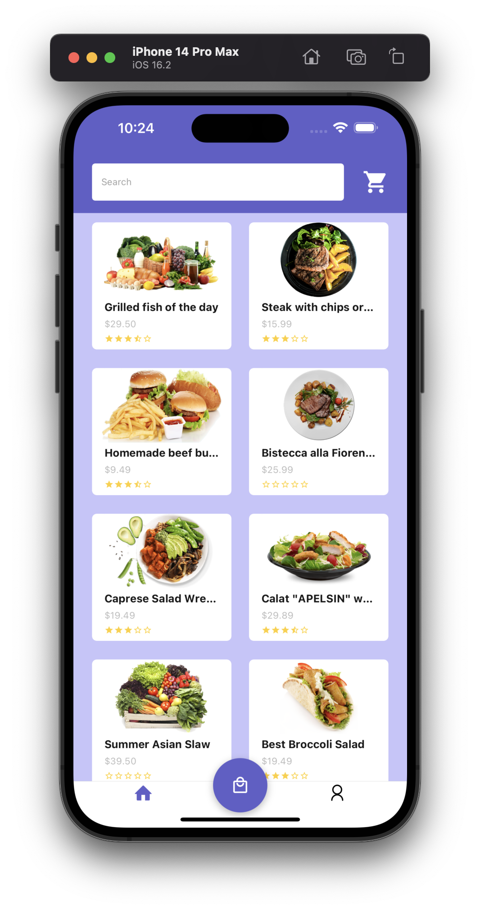
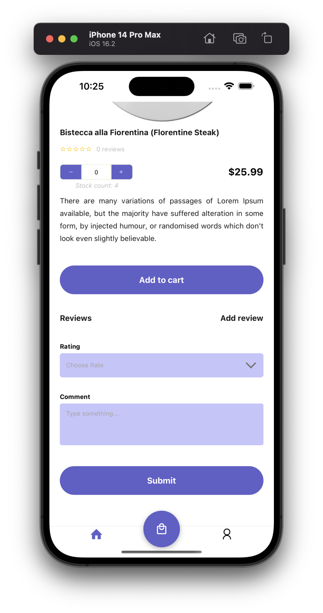
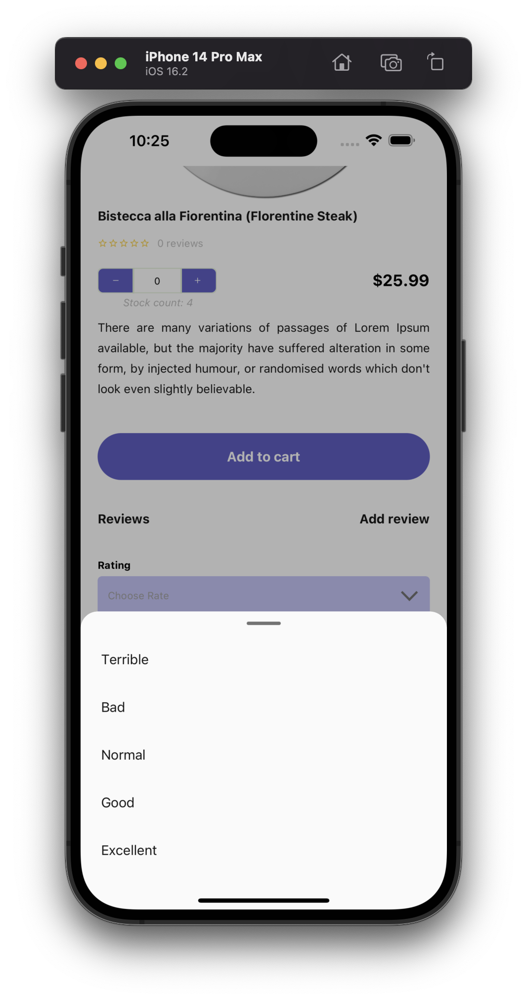
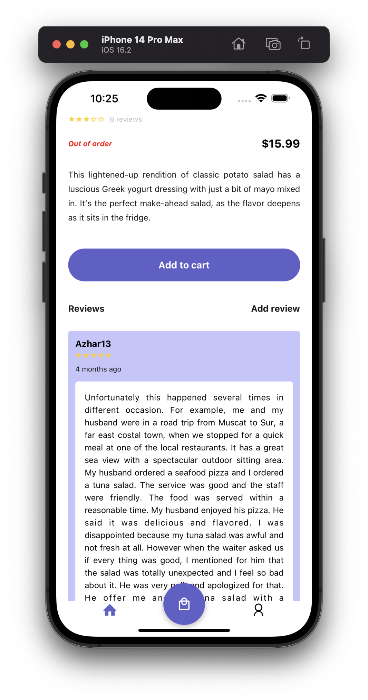
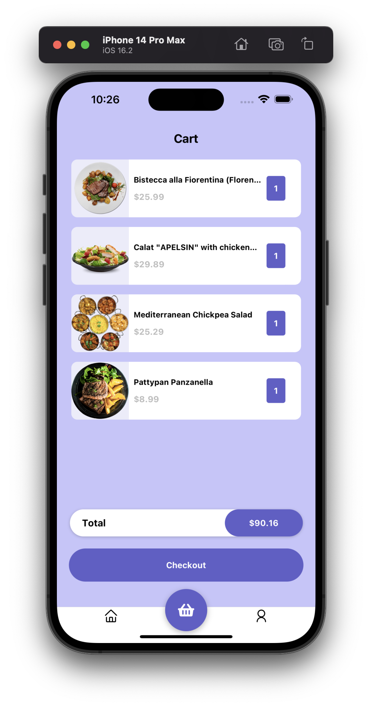
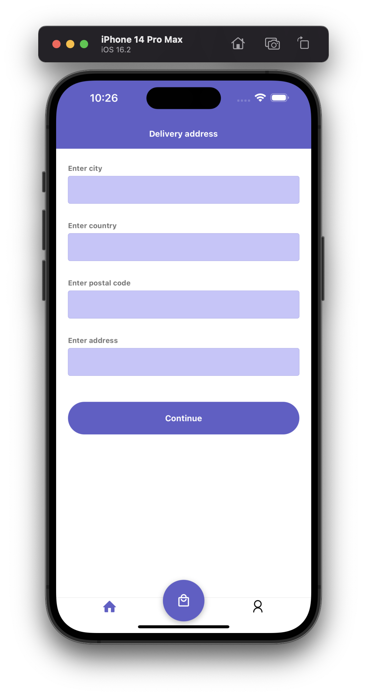
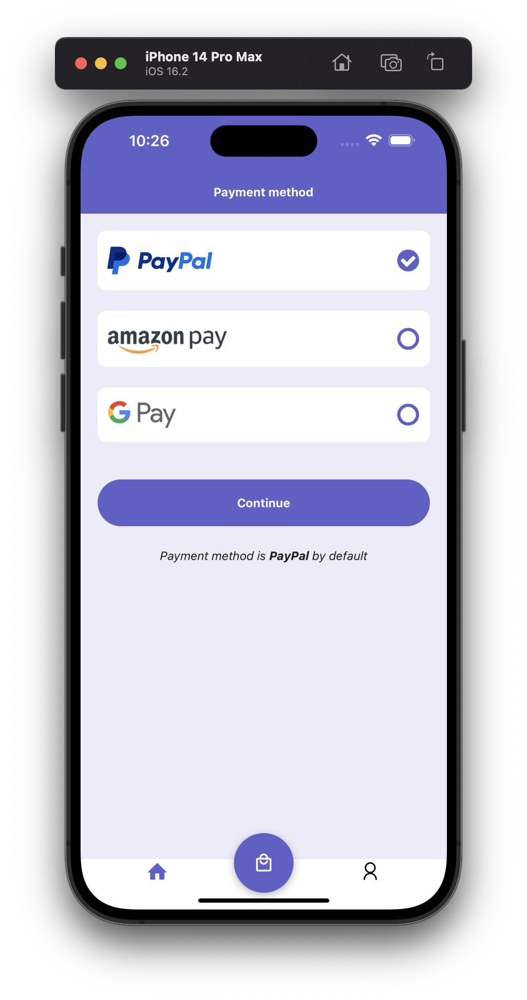
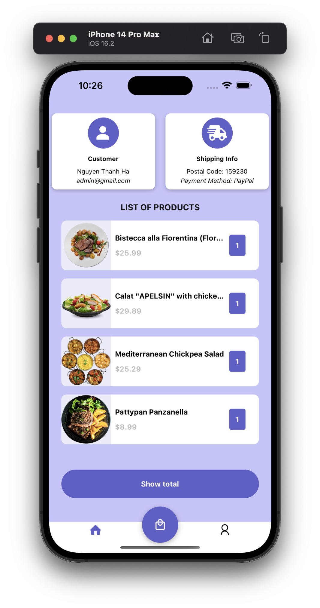
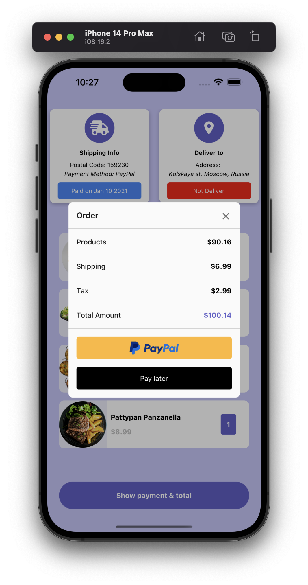
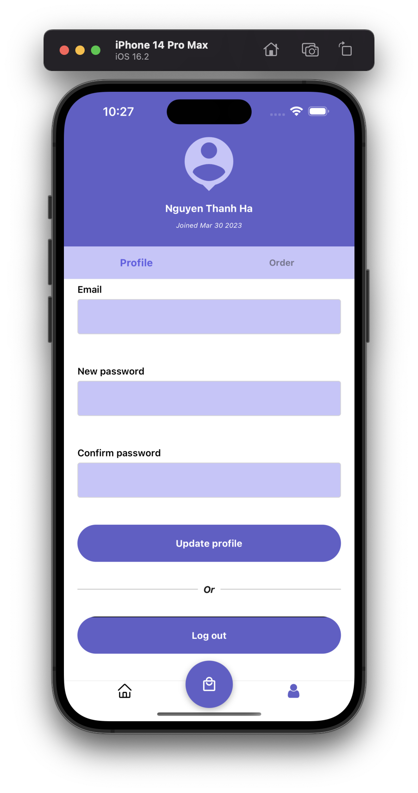

# A Food app with `React-Native` + `NativeBase` 🍟

### Technologies ✨

- `React-Native`, works on both `ios` and `android`
- `Expo`
- `NativeBase`
- `@react-navigation/bottom-tabs` and `@react-navigation/native-stack`
- `@reduxjs/toolkit`

### Screenshots 🌃

IOS | Android
:-: | :-:
<video src='https://github.com/ng-ha/food-app/assets/115610452/ac968ca0-0b43-4e82-a82b-6b44b4bd586f' width=180/> | <video src='https://github.com/ng-ha/food-app/assets/115610452/63c75bb7-ef81-41e4-9179-6258d205de4b' width=180/>

### License :right_anger_bubble:

[MIT](https://choosealicense.com/licenses/mit/)
